
Control System Design Final Project

Translational Inverted Pendulum

MECA 482 Controls Theory and Design

California State University, Chico

 

Ahmad Alherz

Alex Gentes

Jorge Carranza Perez

Luis Hernandez

Cristian Rodriguez

 
 

December 25, 2019

 
 

Introduction

The goal of the control theory in this project is to describe and predict the underactuated and non-linear motion of a pendulum, and control it to balance upright. What can be expected from this project is a mathematical representation of the physical model that can be run on a computer software system such as matlab or simulink in order to virtually test the systems response to varying conditions. Finally, we will be adding a PID controller in order to balance the pendulum in an upright position. This step will be facilitated through the use of the matlab function “pid”.
 

Modeling

 

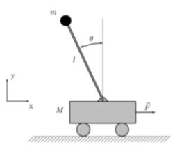

Figure 1. Simplified model of Inverted Pendulum

 

The first step in deriving the mathematical equations of motion is to draw out the free body diagram. Assuming the rod is massless, we can neglect its Inertial effects from the system and thus from the free body diagram.

 

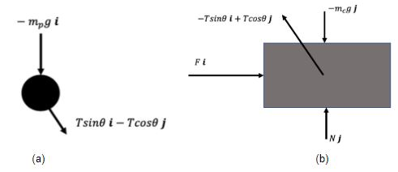

Figure 2. (a) Free body diagram of isolated pendulum (b) Free body diagram of sliding cart attached to pendulum.

 

The approach taken in this paper used to derive the motions of equations is that of kinematics. A more elegant approach, according to research on the topic would have been to use a Lagrange method, which uses the kinetic energy and internal energy of the system components to reduce the mechanical system to a mathematical representation. This approach, however more elegant, is more involved mathematically and the group decided to use a more familiar method. 

 

Starting the interpretation of the free body diagrams from Figure 2, Newton’s second law is applied in order to balance the forces.

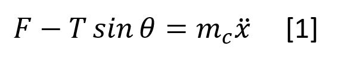

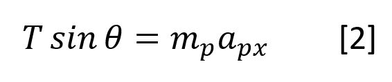

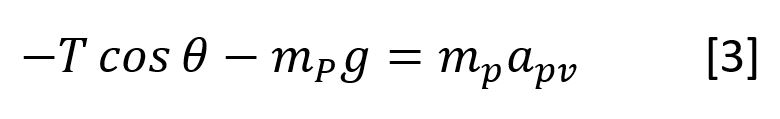

 

Equation [1] is the sum of the forces applied to the cart in the i direction. The force acting on the cart in the i direction is representative of an attached motor or pulley system used to induce a motion on the cart. This will ultimately be the input for the system. Equation [2] and [3] are simply the force balance equations for the forces acting on the pendulum as shown on the free body diagram, Figure (a).

The next step in turning the kinematic equations into usable mathematical representations for the systems motions is to choose the state space variables and put equations [1], [2] and [3] into those terms. 

 

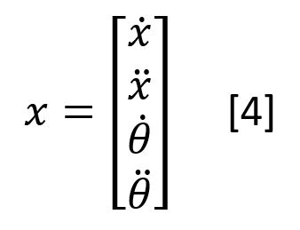
  
 

In order to get all terms from equations [1] through [3] into the state space variables, the acceleration terms need to be converted. Choosing a reference frame allows us to relate the acceleration of the pendulum to the acceleration of the cart. From this we can express the acceleration as follows.
  
 
 

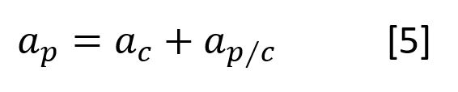
  
 

Relating equation [5] to the free body diagram on Figure 2 it can be seen that the acceleration of the cart is a simple replacement of terms for the state space variables representing acceleration. The acceleration of the pendulum with respect to the acceleration of the cart can be inferred by realizing the only motion the pendulum can follow around the cart is that of a circle and thus only contains two acceleration terms, tangential acceleration and centripetal acceleration.

 

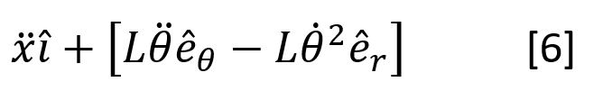

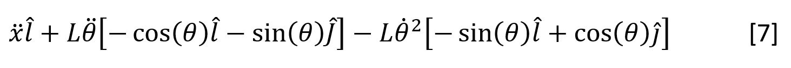  

 

Equation [7] is simply equation [6] written in the frame of reference of i and j instead of the pendulum frame of reference with coordinates of êθ and êr . By substituting the corresponding directions vectors from equation [7] into equations [2] and [3] for the acceleration terms, we get the two new equations written below. 

 

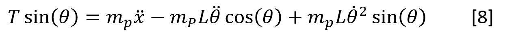

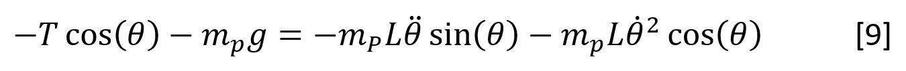 
  
 

Getting rid of the T value in equations [8] and [9] is achievable by multiplying equation [8] by cosθ and multiplying equation [9] by sinθ and adding the results together. This algebra manipulation simplifies equations [8] and [9] into the form shown below.

 

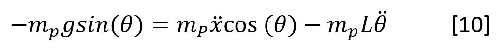

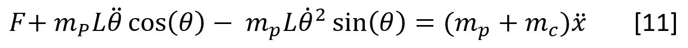
  
 

Equations [10] and [11] are the resulting equations of motion that describe the kinematics of the cart and pendulum using Newton’s second law. They are both expressed in terms of state space variables however they are both highly nonlinear equations, which creates a problem when trying to apply accurate controls techniques learned from this course. Linearization is then required to get our equations into the forms needed before they can be used as a transfer function. The method used to linearize the equations is to take the nonlinear terms of the equations, in this case all the sin() and cos() terms, and approximate their values at a known state with small deviations from that value. In the case of our design, the two known steady state positions for the system is either when the pendulum is at its downward position (θ = 0 degrees) or when the pendulum is completely upright (θ=90 degrees). From these positions, we can allow the pendulum to deviate only in small increments in order to achieve stability, at which point the controller should intervene when this limit is exceeded.

 

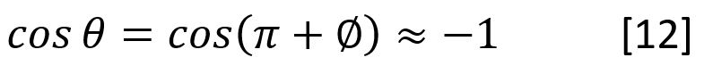

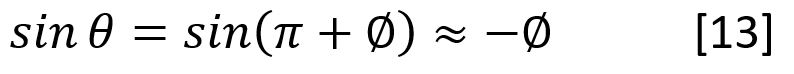

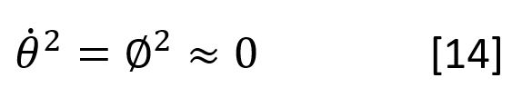
  
 

With equations [12] through [14] we are able to substitute the approximate value for the nonlinear portion of the motion equations, evaluated at a known value with small deviations. Doing this, we substitute all sin() and cos() portions in equations [10] and [11] with -1 and -phi. Since theta dot squared is also a nonlinear term, we evaluate that to be phi squared which we want to be as close to zero as possible. The physical representation of this value would be the velocity of the pendulum. After making the substitution, we end up with the equations below.

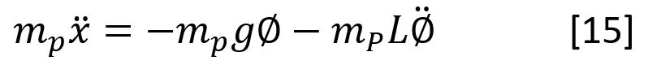

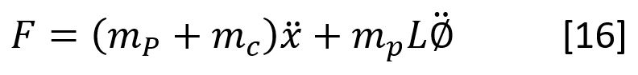  
  
 

Equations [15] and [16] are the final result for the equations of  motion describing the pendulum on a cart after linearization. What is left to do is to take the Laplace transform of the system equations assuming zero initial conditions. 

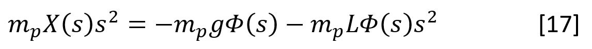

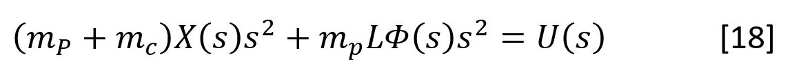 

 

Equations [17] and [18] are the result of the Laplace transport, of which, equation [17] is solved for X(s) [19] and substituted into equation [18]  in order to eliminate X(s) in equation [18]. This allows us to form a (SISO) single input-single output transfer function with the output being Phi(s) and the input U(s) in equation [20] describing the position of the pendulum.

 

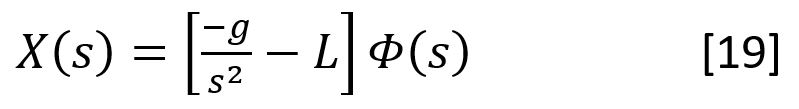

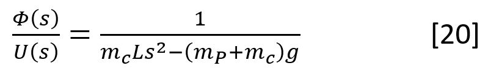 
  
The State Space Representation of the system can also be achieved in the same manner. Taking equation [16] and solving for Phi double dot we can substitute it into equation [15] to eliminate the Phi double dot completely resulting in equation [21]. Vice versa solving for X double dot in equation [15] and substituting into equation [16] eliminates X double dot and results in equation [22].

 

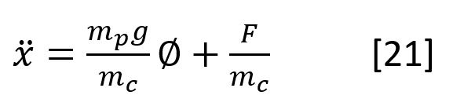

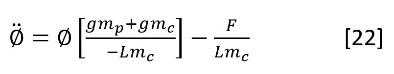 
  
When trying to tune the PID controller using the above equations we found that the system was too unstable to achieve a desirable outcome, as can be seen in the controller design and simulation section. Therefore, following the aforementioned steps we arrived at the following transfer functions which do account for the inertial mass of the pendulum. 

 

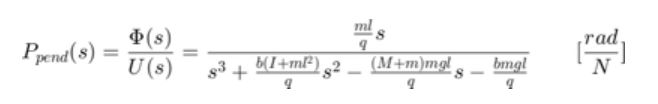

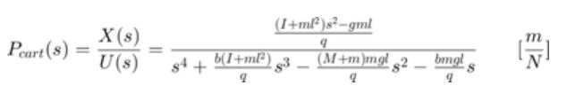 

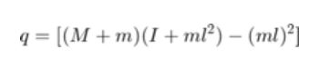 
  
 

Controller Design and Simulation

 

Using the state space model described above we first ran the open loop response, and then tuned the PID controller to achive a semi stable response.

 

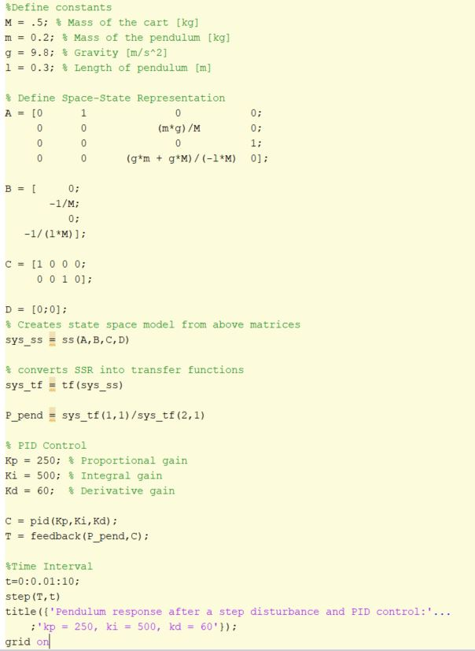

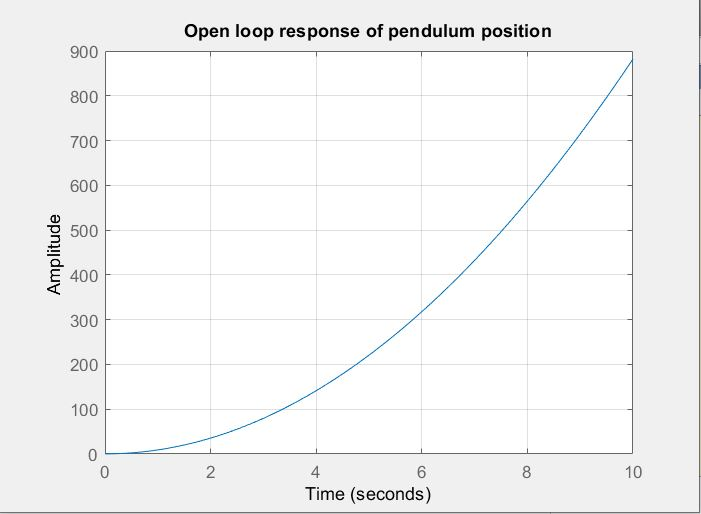 

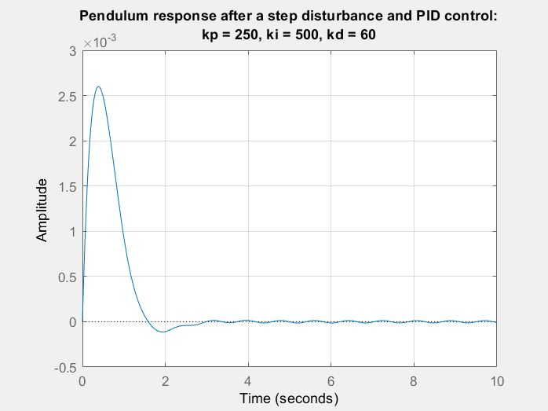 

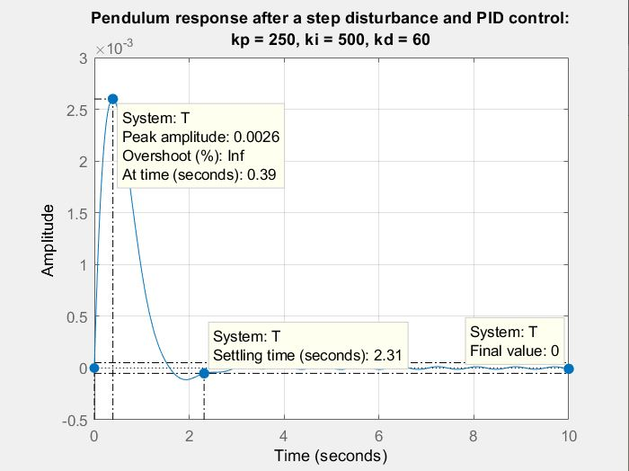 

